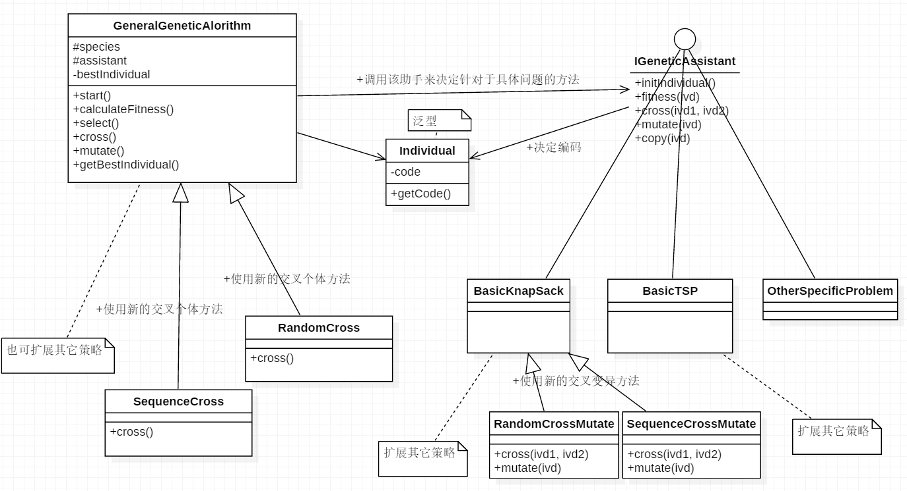

14302010040_武多才

## 实验报告

### 一、算法说明

#### 基因算法

基因算法有一套公共的完整的框架，伪代码如下。

```ruby
begin
  set time t = 0 # first generation
  initGeneration() # initialize the population P(t)
  while the termination condition isnot met do
  begin
    
    fitness() # evaluate fitness of each member of the population P(t);
    select() # select members from population P(t) based on fitness;
    
    # produce the offspring of these pairs using genetic operators(cross,mutate);
    # replace candidates of P(t), with these offspring;
    cross() #
    mutate() #
    
    set time t = t + 1 # new generation
  end
end
```

结合以上代码来分析一下基因算法：

1. 第3行，首先要初始化第一代种群。这里涉及到一个个体是如何编码的，这一点对于不同的具体问题，要做出不同的实现。
2. 第4~16行，在终止条件到来之前，种群一代代循环进化，具体如下：
   1. 第7行，计算种群个体的适应度，这里可以评估最优秀个体和平均适应度等。这一点上适应度对于不同的具体问题，其个体适应度计算方法不同，要做出不同实现。
   2. 第8行，根据个体的适应度不同，选出优秀的个体。这一点有多种不同的策略，例如轮盘赌策略和随机二选一的策略。
   3. 12~13行，选出优秀的个体之后，我们要用这些个体产生新一代的种群。具体方法则是交叉和变异。这里有两点需注意，一是交叉或变异的个体的选择有多种不同的策略，二是针对于不同的具体问题，交叉或变异的具体方法不同。
   4. 第15行，经过以上操作产生了新的一代，在这里做出标记。
3. 当达到终止条件时，则结束进化。

####  代码设计

根据上述描述分析可以看出，基因算法有一套公用的框架。但有两点值得注意，一是选择，交叉，变异的个体选择有多种不同的策略；二是针对于不同的具体问题，个体的基因编码、交叉和变异的具体方式可能不同。所以在设计框架时，要为这两点留出余地，以便：1. 方便复用代码扩展新策略的基因算法，2. 复用代码实现针对于具体问题的基因算法。

设计图如下：



如设计图所示，GeneralGeneticAlgorithm已经实现了基因算法的基本框架，选择，交叉，变异的个体选择都有默认实现。

	其默认的选择个体的策略时轮盘赌的策略。
	默认的交叉是以一定概率挨个询问个体是否交叉，凑够两个时将两个个体进行交叉。
	默认的变异是以一定概率挨个询问个体是否要变异。

其次使用该框架时，必须传入一个继承IGeneticAssistant接口的assistant，assistant决定个体的编码，交叉和变异方式。

使用如下：

```java
IGeneticAssistant assistant = new BasicKnapSack(); //以背包问题为例
GeneralGeneticAlgorithm algorithm = 
			new GeneralGeneticAlgorithm(iterationMax, scale,
			assistant, crossP, mutateP);//其他参数是迭代次数，种群规模，交叉概率，变异概率

algorithm.start(true); //调用此函数开始迭代，true表示迭代过程中打印出每代信息

// 结束后可以取出最好的个体
System.out.println(algorithm.getBestIndividual().toString());
```

然后也可以继承GeneralGeneticAlgorithm复用代码来实现新策略的基因算法，如图SequenceCross和RandomCross都是复写了父类cross算法，采用不通的策略来选择要交叉的个体。

#### 背包问题

这时候解决背包问题就简单了，只要实现IGeneticAssistant决定个体的编码，适应度评估，交叉，变异和拷贝方式。如上设计图所示的BasicKnapsack类采用如下具体设计。

1. 个体编码：用一个byte数组表示DNA，个体DNA的长度就是所有物品的数目，然后每一个位置的基因设置为0或1，表示不拿或拿当前的物品
2. 适应度评估：评估方式很简单，就是将选择的个体的价值都加起来，作为适应度；但如果其总重量超过背包容量，就将其适应度置为0（为防止小概率的种群总适应度为0的情况，可以将此适应度置为接近0，如1e-10）
3. 交叉：交叉方式是随机选一个起点和终点，然后将两个个体在起点和终点之间的基因段进行交换。
4. 变异：变异方式是随机选一个起点和终点，然后将该个体在起点和终点之间的基因段中0变1，1变0
5. 拷贝：由于编码采用数组，所以复制产生新个体时，要将数组中每个值都拷贝一份，才能避免使用相同地址空间。

然后设计图中RandomCrossMute复写交叉和变异的方法：

1. 交叉：随机生成要改变基因数，然后挑选随机位置的基因进行互换。
2. 变异：随机生成要改变基因数，然后挑选随机位置的基因0，1倒置。

设计图中的SequenceCrossMute顾名思义就是沿用了默认的方法，将其单独写出来，只是使得结构清新一点。

扩展其它策略的便签是指也可以继承BasicKnapsack来复写特定方法更改策略。

#### 旅行商问题

旅行商问题也是要实现IGeneticAssistant决定个体的编码，评估，交叉，变异和拷贝方式。如上设计图所示的BasicTSP类采用如下具体设计(首先将所有地点存在一个数组里)。

1. 个体编码：用一个int数组表示DNA，DNA是地点访问顺序的一个序列，也就地点数组下标的一个序列。

2. 适应度评估：首先计算出旅行商按该个体DNA序列出发再回到起点的总路程，取其倒数作为适应度。也就是距离越短适应度越高

3. 交叉：交叉的方式比教复杂，举个列子：

   ```java
   // 这是为交叉之前的两个DNA序列，先随机选取两个点将其分成三份。
   p1 = ( 1 9 2 | 4 6 5 7 | 8 3 )
   p2 = ( 4 5 9 | 1 8 7 6 | 2 3 )
   // 然后将p2从第三部分开始得到临时的新序列tmp2
   tmp2 = 2 3 4 5 9 1 8 7 6
   // 这时候p1的三部分中的中间那部分（记为p12）保持不动，
   // 然后将第一部分和第三部分依此用tmp2中不在p12区间内的元素替换
   // 然后就可以得到p1交叉后的结果c2
   c1 = ( 2 3 9 | 4 6 5 7 | 1 8 )
   // 同样，也可以得到p2交叉后的c2
   c2 = ( 3 9 2 | 1 8 7 6 | 4 5 )
   ```

4. 变异：变异比较简单，举个列子：

   ```java
   // 同样将待变异p1随机分成三部分
   p1 = ( 1 9 2 | 4 6 5 7 | 8 3 )
   // 然后将中间部分颠倒顺序就得到变异后的c1
   c1 = ( 1 9 2 | 7 5 6 4 | 8 3 )
   ```

5. 拷贝：由于编码采用数组，所以复制产生新个体时，要将数组中每个值都拷贝一份，才能避免使用相同地址空间。

最后扩展其它策略的便签是指也可以继承BasicTSP来复写特定方法更改策略，我没有实现其它策略。

### 二、背包问题实验分析

#### 实验设计

```java
	static double[] mutatePs = {0.05,0.1,0.15,0.2,0.3,0.5,0.8};
	static double[] crossPs = {0.3,0.5,0.7,0.85};
	static int[] scales = {500,1000,1500};

	for (int i = 0; i < crossPs.length; i++) {
      for (int j = 0; j < mutatePs.length; j++) {
        for (int j2 = 0; j2 < scales.length; j2++) {
          doTrain(crossPs[i], mutatePs[j],
                  scales[j2], 10000);
        }
      }
	}
```

实验设计就像如上代码所示，分别以一定的区间来跑完所有的测试，然后将每组测试输入的到对应的文件中。实验跑完之后，对实验结果进行分析，然后缩小区间再进行实验。

#### 实验输出模式

实验过程中每隔300代输出一次，模式如下：

```java
// 当前代数，当前代最佳适应度，当前代平均适应度，所有代中最佳适应度
g: 9901,best: 106.29999999999998,average: 82.61720000001445,best in total: 106.29999999999998
```

最终会输出最佳个体，以及最佳个体最早出现的代数

```java
// 代数：适应度，个体编码
351:106.29999999999998,0 1 0 0 1 0 1 0 0 0 1 0 0 0 0 0 0 0 1 0 1 0 0 0 0 0 0 1 0 0 1 0 1 0 1 0 1 1 1 0 0 1 0 1 0 0 0 0 0 1 
```

#### 实验结果分析

实验结果从以下角度来衡量

1. 最佳个体适应度：参数优良性
2. 最佳个体最早出现代数：收敛速度
3. 最终几代最佳适应度和平均适应度：参数对种群特征的影响。

实验参数会从种群规模，交叉概率，变异概率，交叉变异算法来分析，实验结果见附件部分，具体分析如下

以下结果默认是随机选择交叉个体，具体的交叉变异方法是连续一段的交叉变异。

1.   种群规模影响
     | 实验序号 | 交叉概率 | 变异概率 | 种群规模 | 最佳最早出现代数 | 最佳个体适应度 |  最终代最高/平均适应度  |
     | :--: | :--: | :--: | :--: | :------: | :-----: | :-----------: |
     |  1   | 0.3  | 0.05 | 1000 |   4985   | 101.39  | 96.599/91.689 |
     |  2   | 0.3  | 0.05 | 1500 |   6039   | 104.69  | 102.99/98.249 |
     |  3   | 0.3  | 0.05 | 500  |   7199   | 103.29  | 99.399/95.099 |
     |  4   | 0.3  | 0.15 | 1000 |   5167   | 104.69  | 103.39/88.305 |
     |  5   | 0.3  | 0.15 | 1500 |   2543   | 106.29  | 104.69/87.514 |
     |  6   | 0.3  | 0.15 | 500  |   5384   | 106.29  | 104.79/85.406 |
     |  16  | 0.3  | 0.5  | 1000 |   4934   | 106.29  | 101.69/56.033 |
     |  17  | 0.3  | 0.5  | 1500 |   1759   | 106.29  | 102.49/55.495 |
     |  18  | 0.3  | 0.5  | 500  |   5568   | 106.29  | 99.699/58.009 |
     |  19  | 0.3  | 0.8  | 1000 |   8131   | 103.39  |  93.5/39.687  |
     |  20  | 0.3  | 0.8  | 1500 |   2565   | 106.29  | 95.399/38.583 |
     |  21  | 0.3  | 0.8  | 500  |   4590   | 102.89  | 88.099/39.505 |

     从以上数据每三组对比分析，可得

     1.   种群规模较大的1500每次都取得最好的结果，而且除了第1、2、3组之外其它都是种群规模大的更快得到最优的个体。
     2.   但是种群规模大会导致训练速度变慢。

2.   交叉变异概率的影响

     | 实验序号 | 交叉概率 | 变异概率 | 种群规模 | 最佳最早出现代数 | 最佳个体适应度 |  最终代最高/平均适应度  |
     | :--: | :--: | :--: | :--: | :------: | :-----: | :-----------: |
     |  1   | 0.3  | 0.05 | 1000 |   4985   | 101.39  | 96.599/91.689 |
     |  2   | 0.3  | 0.05 | 1500 |   6039   | 104.69  | 102.99/98.249 |
     |  3   | 0.3  | 0.05 | 500  |   7199   | 103.29  | 99.399/95.099 |
     |  19  | 0.3  | 0.8  | 1000 |   8131   | 103.39  | 93.5,a/39.687 |
     |  20  | 0.3  | 0.8  | 1500 |   2565   | 106.29  | 95.399/38.583 |
     |  21  | 0.3  | 0.8  | 500  |   4590   | 102.89  | 88.099/39.505 |
     |  22  | 0.5  | 0.05 | 1000 |   4222   | 106.29  | 103.99/98.414 |
     |  23  | 0.5  | 0.05 | 1500 |    0     | 1.0E-1  | 1.0E-1/9.9999 |
     |  24  | 0.5  | 0.05 | 500  |    0     | 1.0E-1  | 1.0E-1/1.0000 |
     |  43  | 0.7  | 0.05 | 1000 |    0     | 1.0E-1  | 1.0E-1/9.9999 |
     |  44  | 0.7  | 0.05 | 1500 |    0     | 1.0E-1  | 1.0E-1/9.9999 |
     |  45  | 0.7  | 0.05 | 500  |    0     | 1.0E-1  | 1.0E-1/1.0000 |
     |  73  | 0.85 | 0.2  | 1000 |   3235   | 106.29  | 106.29/82.733 |
     |  74  | 0.85 | 0.2  | 1500 |   351    | 106.29  | 106.29/82.617 |
     |  75  | 0.85 | 0.2  | 500  |    0     | 1.0E-1  | 1.0E-1/1.0000 |
     |  76  | 0.85 | 0.3  | 1000 |   569    | 106.29  | 104.79/69.521 |
     |  77  | 0.85 | 0.3  | 1500 |   386    | 106.29  | 104.59/71.282 |
     |  78  | 0.85 | 0.3  | 500  |   6896   | 106.29  | 104.79/72.296 |
     |  79  | 0.85 | 0.5  | 1000 |   2752   | 106.29  | 103.09/56.570 |
     |  80  | 0.85 | 0.5  | 1500 |   340    | 106.29  | 101.89/56.360 |
     |  81  | 0.85 | 0.5  | 500  |   6702   | 106.29  | 94.599/54.731 |

     根据以上数据，可以看出交叉变异会严重影响种群，有以下几点

     1. 由于初始值是随机二选一，平均会选一半物品，导致一般一开始都会超过背包容积，这时，如果变异概率很小，会导致种群难以进化，根据上表，可以看到这一点再种群规模小，交叉概率大的时候更加显著。
     2. 交叉变异的概率增大，会使得种群的收敛速度变快，种群1500的基础上，上表74、77、80都是在500次以内收敛，而交叉变异概率小的3、20则收敛较慢。3和20内部对比，后者变异概率大，收敛也相对快许多。
     3. 交叉变异概率变大会导致种群不稳定。上图3和20对比，可以看到20虽然很快遇到更好的个体。但是种群很不稳定，最优解无法维持下去，种群平均适应度很低。后面74-81虽然结果很好，但也有相同问题。

       根据以上分析，可以得出一个结论，在背包问题情况下，对于种群平均适应度要求不高，当种群最佳适应度和平均适应度保持一定距离时，结果会更好。

3.   交叉变异方法对比。

     附件中第二部分的实验结果采用的交叉，变异方法是基因的位置为每一个都随机选择，根据实验结果可以看出效果整体都很差，种群不稳定，收敛速度也慢。

4.   交叉个体选择方法

     附件中第三部分为实验数据，交叉个体的选择方法是顺序选取，这个使得种群更加稳定一定，相比于前者，他更适合于交叉变异概率较小的，收敛速度较慢。


### 三、旅行商问题实验分析

#### 实验设计

```java
	static double[] mutatePs = {0.02,0.025,0.35};
	static double[] crossPs = {0.065,0.075,0.85};
	static int[] scales = {4000,5000,6000};
	for (int i = 0; i < crossPs.length; i++) {
			for (int j = 0; j < mutatePs.length; j++) {
				for (int j2 = 0; j2 < scales.length; j2++) {
					doTrain(crossPs[i], mutatePs[j],
							scales[j2], 18000);
				}
			}
		}
```

实验设计就像如上代码所示，分别以一定的区间来跑完所有的测试，然后将每组测试输入的到对应的文件中。实验跑完之后，对实验结果进行分析，然后缩小区间再进行实验。上述代码为调整后的小区间，全部实验见附件第5部分。

#### 实验输出模式

实验过程中每隔300代输出一次，模式如下：

```java
// 当前代数，当前代最佳适应度，当前代平均适应度，所有代中最佳适应度（适应度为路径长度的倒数）
g: 17701,best: 0.002321846556641697,average: 0.0021039901608931526,best in total: 0.0023259620846458728
```

最终会输出最佳个体，以及最佳个体最早出现的代数

```java
// 代数：适应度，个体编码
17089:429.9296220695918,47 22 6 42 23 13 24 12 40 39 18 41 43 14 44 32 38 9 48 8 29 33 49 20 28 15 1 19 34 35 2 27 30 25 7 21 0 31 10 37 4 36 16 3 17 46 11 45 50 26 5 
```

#### 实验结果分析

实验结果从以下角度来衡量

1. 最佳个体适应度：参数优良性
2. 最佳个体最早出现代数：收敛速度
3. 最终几代最佳适应度和平均适应度：参数对种群特征的影响。

实验参数会从种群规模，交叉概率，变异概率，交叉变异算法来分析，实验结果见附件部分，具体分析如下

以下结果默认是随机选择交叉个体，具体的交叉变异方法为前述默认方法。最佳个体适应度是路径长度，而后面最终代最高/平均适应度是路径长度的倒数。

1. 种群规模影响

   | 实验序号 | 交叉概率 | 变异概率 | 种群规模 | 最佳最早出现代数 | 最佳个体适应度 |  最终代最高/平均适应度  |
   | :--: | :--: | :--: | :--: | :------: | :-----: | :-----------: |
   |  10  | 0.06 | 0.03 | 1000 |  13507   | 445.50  | 0.0022/0.0020 |
   |  11  | 0.06 | 0.03 | 2500 |  11020   | 445.39  | 0.0022/0.0020 |
   |  12  | 0.06 | 0.03 | 500  |  17860   | 476.76  | 0.0020/0.0018 |
   |  13  | 0.06 | 0.03 | 5000 |  15618   | 435.16  | 0.0022/0.0021 |
   从以上数据四组对比分析（更多数据参考附件第四部分），可得
   1. 种群规模较大的5000每次都取得最好的结果，种群规模最小的500效果最差也最慢。
   2. 种群规模大会导致训练速度变慢。

2. 交叉变异概率的影响

   | 实验序号 | 交叉概率  | 变异概率  | 种群规模 | 最佳最早出现代数 | 最佳个体适应度 |  最终代最高/平均适应度  |
   | :--: | :---: | :---: | :--: | :------: | :-----: | :-----------: |
   |  71  | 0.15  |  0.3  | 1000 |   563    | 946.01  | 8.2668/6.9977 |
   |  72  | 0.15  |  0.3  | 2500 |  16398   | 842.64  | 9.7658/7.7972 |
   |  73  | 0.15  |  0.3  | 500  |  13847   | 976.77  | 8.3581/7.1739 |
   | 103  | 0.85  | 0.025 | 4000 |   9200   | 1080.3  | 7.6112/6.1638 |
   | 104  | 0.85  | 0.025 | 5000 |  16642   | 1093.1  | 7.7736/6.1849 |
   | 105  | 0.85  | 0.025 | 6000 |  11123   | 1112.4  | 7.6321/6.1895 |
   |  4   | 0.065 | 0.02  | 4000 |  17088   | 446.83  | 0.0021/0.0020 |
   |  5   | 0.065 | 0.02  | 5000 |  17537   | 435.80  | 0.0022/0.0020 |
   |  6   | 0.065 | 0.02  | 6000 |  12531   | 442.49  | 0.0022/0.0020 |
   |  22  | 0.075 | 0.025 | 4000 |  13851   | 446.72  | 0.0022/0.0020 |
   |  23  | 0.075 | 0.025 | 5000 |  17823   | 445.51  | 0.0022/0.0019 |
   |  24  | 0.075 | 0.025 | 6000 |  17089   | 429.92  | 0.0023/0.0021 |
   根据上表数据可得

   1. 首先TSP问题没有前述背包问题所说的，无法跳出初始值的问题。
   2. 与背包问题不同，TSP问题更适合较小的交叉变异概率，当种群很稳定的时候才更容易得到更好的解
   3. 交叉变异概率对收敛速度的影响不显著。
      由以上分析，旅行商问题再训练过程中要保持大量的优良个体才能很好进化。从分析数据来看平均适应度总是与最佳适应度很接近。
3. 交叉变异方法对比。

   这一点没有实现多终交叉变异方法，暂时没有数据。

4. 交叉个体选择方法
   附件第五部分为顺序选择交叉个体的方法，换用这种方法影响不是很显著，同样要求较小的交叉变异概率。性能略差一点。

### 四、附实验结果

#### 1. 背包问题，随机选择交叉个体算法；交叉变异基因为连续一段

| 实验序号 | 交叉概率 | 变异概率 | 种群规模 | 最佳最早出现代数 | 最佳个体适应度 |  最终代最高/平均适应度  |
| :--: | :--: | :--: | :--: | :------: | :-----: | :-----------: |
|  1   | 0.3  | 0.05 | 1000 |   4985   | 101.39  | 96.599/91.689 |
|  2   | 0.3  | 0.05 | 1500 |   6039   | 104.69  | 102.99/98.249 |
|  3   | 0.3  | 0.05 | 500  |   7199   | 103.29  | 99.399/95.099 |
|  4   | 0.3  | 0.15 | 1000 |   5167   | 104.69  | 103.39/88.305 |
|  5   | 0.3  | 0.15 | 1500 |   2543   | 106.29  | 104.69/87.514 |
|  6   | 0.3  | 0.15 | 500  |   5384   | 106.29  | 104.79/85.406 |
|  7   | 0.3  | 0.1  | 1000 |   5313   | 105.79  | 104.29/92.617 |
|  8   | 0.3  | 0.1  | 1500 |    0     | 1.0E-1  | 1.0E-1/9.9999 |
|  9   | 0.3  | 0.1  | 500  |   9992   | 103.09  | 100.39/89.534 |
|  10  | 0.3  | 0.2  | 1000 |   5965   | 106.29  | 106.29/85.317 |
|  11  | 0.3  | 0.2  | 1500 |   636    | 106.29  | 106.29/85.634 |
|  12  | 0.3  | 0.2  | 500  |   8019   | 105.79  | 103.29/81.738 |
|  13  | 0.3  | 0.3  | 1000 |   9397   | 106.29  | 103.19/72.396 |
|  14  | 0.3  | 0.3  | 1500 |   2860   | 106.29  | 106.29/71.079 |
|  15  | 0.3  | 0.3  | 500  |   419    | 106.29  | 106.29/75.727 |
|  16  | 0.3  | 0.5  | 1000 |   4934   | 106.29  | 101.69/56.033 |
|  17  | 0.3  | 0.5  | 1500 |   1759   | 106.29  | 102.49/55.495 |
|  18  | 0.3  | 0.5  | 500  |   5568   | 106.29  | 99.699/58.009 |
|  19  | 0.3  | 0.8  | 1000 |   8131   | 103.39  | 93.5,a/39.687 |
|  20  | 0.3  | 0.8  | 1500 |   2565   | 106.29  | 95.399/38.583 |
|  21  | 0.3  | 0.8  | 500  |   4590   | 102.89  | 88.099/39.505 |
|  22  | 0.5  | 0.05 | 1000 |   4222   | 106.29  | 103.99/98.414 |
|  23  | 0.5  | 0.05 | 1500 |    0     | 1.0E-1  | 1.0E-1/9.9999 |
|  24  | 0.5  | 0.05 | 500  |    0     | 1.0E-1  | 1.0E-1/1.0000 |
|  25  | 0.5  | 0.15 | 1000 |   6060   | 106.29  | 104.79/87.962 |
|  26  | 0.5  | 0.15 | 1500 |   2571   | 106.29  | 102.89/86.541 |
|  27  | 0.5  | 0.15 | 500  |   1542   | 104.6,  | 103.1,/89.511 |
|  28  | 0.5  | 0.1  | 1000 |   3938   | 104.79  | 103.29/93.434 |
|  29  | 0.5  | 0.1  | 1500 |   4393   | 106.29  | 106.29/94.621 |
|  30  | 0.5  | 0.1  | 500  |    0     | 1.0E-1  | 1.0E-1/1.0000 |
|  31  | 0.5  | 0.2  | 1000 |   7809   | 106.29  | 106.29/85.163 |
|  32  | 0.5  | 0.2  | 1500 |   3757   | 104.69  | 103.39/82.550 |
|  33  | 0.5  | 0.2  | 500  |   2265   | 106.29  | 106.29/83.629 |
|  34  | 0.5  | 0.3  | 1000 |   7812   | 106.29  | 106.29/73.506 |
|  35  | 0.5  | 0.3  | 1500 |   1536   | 106.29  | 106.29/71.245 |
|  36  | 0.5  | 0.3  | 500  |    0     | 1.0E-1  | 1.0E-1/1.0000 |
|  37  | 0.5  | 0.5  | 1000 |   2948   | 106.29  | 100.29/55.762 |
|  38  | 0.5  | 0.5  | 1500 |   1235   | 106.29  | 100.79/57.799 |
|  39  | 0.5  | 0.5  | 500  |   3052   | 106.29  | 98.499/58.568 |
|  40  | 0.5  | 0.8  | 1000 |   9313   | 104.79  | 96.599/41.264 |
|  41  | 0.5  | 0.8  | 1500 |   8394   | 104.79  | 97.399/40.271 |
|  42  | 0.5  | 0.8  | 500  |   9418   | 103.69  | 97.399/37.026 |
|  43  | 0.7  | 0.05 | 1000 |    0     | 1.0E-1  | 1.0E-1/9.9999 |
|  44  | 0.7  | 0.05 | 1500 |    0     | 1.0E-1  | 1.0E-1/9.9999 |
|  45  | 0.7  | 0.05 | 500  |    0     | 1.0E-1  | 1.0E-1/1.0000 |
|  46  | 0.7  | 0.15 | 1000 |   1389   | 106.29  | 104.29/88.335 |
|  47  | 0.7  | 0.15 | 1500 |   6355   | 104.69  | 103.39/85.504 |
|  48  | 0.7  | 0.15 | 500  |    0     | 1.0E-1  | 1.0E-1/1.0000 |
|  49  | 0.7  | 0.1  | 1000 |   9427   | 102.89  | 101.99/91.870 |
|  50  | 0.7  | 0.1  | 1500 |   1553   | 106.29  | 104.79/94.321 |
|  51  | 0.7  | 0.1  | 500  |    0     | 1.0E-1  | 1.0E-1/1.0000 |
|  52  | 0.7  | 0.2  | 1000 |   2405   | 106.29  | 106.29/85.934 |
|  53  | 0.7  | 0.2  | 1500 |   1403   | 106.29  | 106.29/85.484 |
|  54  | 0.7  | 0.2  | 500  |   2526   | 106.29  | 106.29/85.170 |
|  55  | 0.7  | 0.3  | 1000 |   696    | 106.29  | 104.6,/73.263 |
|  56  | 0.7  | 0.3  | 1500 |   6709   | 106.29  | 106.29/73.064 |
|  57  | 0.7  | 0.3  | 500  |   3546   | 106.29  | 105.79/73.133 |
|  58  | 0.7  | 0.5  | 1000 |   2175   | 106.29  | 101.49/54.312 |
|  59  | 0.7  | 0.5  | 1500 |   2247   | 106.29  | 98.699/54.269 |
|  60  | 0.7  | 0.5  | 500  |   8570   | 106.29  | 97.699/56.563 |
|  61  | 0.7  | 0.8  | 1000 |   3233   | 103.89  | 95.599/39.389 |
|  62  | 0.7  | 0.8  | 1500 |   4964   | 105.79  | 94.099/39.547 |
|  63  | 0.7  | 0.8  | 500  |   4966   | 104.79  | 95.599/36.744 |
|  64  | 0.85 | 0.05 | 1000 |    0     | 1.0E-1  | 1.0E-1/9.9999 |
|  65  | 0.85 | 0.05 | 1500 |   6533   |  101.6  | 97.5,a/92.037 |
|  66  | 0.85 | 0.05 | 500  |    0     | 1.0E-1  | 1.0E-1/1.0000 |
|  67  | 0.85 | 0.15 | 1000 |   6378   | 106.29  | 106.29/88.827 |
|  68  | 0.85 | 0.15 | 1500 |   1306   | 106.29  | 105.79/89.643 |
|  69  | 0.85 | 0.15 | 500  |   3931   | 106.29  | 106.29/89.689 |
|  70  | 0.85 | 0.1  | 1000 |   6697   | 104.79  | 103.29/93.269 |
|  71  | 0.85 | 0.1  | 1500 |   2893   | 106.29  | 103.99/93.249 |
|  72  | 0.85 | 0.1  | 500  |   2996   | 104.6,  | 103.1,/92.126 |
|  73  | 0.85 | 0.2  | 1000 |   3235   | 106.29  | 106.29/82.733 |
|  74  | 0.85 | 0.2  | 1500 |   351    | 106.29  | 106.29/82.617 |
|  75  | 0.85 | 0.2  | 500  |    0     | 1.0E-1  | 1.0E-1/1.0000 |
|  76  | 0.85 | 0.3  | 1000 |   569    | 106.29  | 104.79/69.521 |
|  77  | 0.85 | 0.3  | 1500 |   386    | 106.29  | 104.59/71.282 |
|  78  | 0.85 | 0.3  | 500  |   6896   | 106.29  | 104.79/72.296 |
|  79  | 0.85 | 0.5  | 1000 |   2752   | 106.29  | 103.09/56.570 |
|  80  | 0.85 | 0.5  | 1500 |   340    | 106.29  | 101.89/56.360 |
|  81  | 0.85 | 0.5  | 500  |   6702   | 106.29  | 94.599/54.731 |
|  82  | 0.85 | 0.8  | 1000 |   3644   | 104.79  | 96.999/38.306 |
|  83  | 0.85 | 0.8  | 1500 |   4584   | 106.29  | 93.399/39.997 |
|  84  | 0.85 | 0.8  | 500  |   8873   | 103.29  |  93.4/35.783  |

#### 2. 背包问题，随机选择交叉个体算法；交叉变异基因为随机选择的

| 实验序号 | 交叉概率 | 变异概率 | 种群规模 | 最佳最早出现代数 | 最佳个体适应度 | 最终代最高/平均适应度   |
| :--: | :--: | :--: | ---: | :------: | :-----: | ------------- |
|  1   | 0.3  | 0.05 | 1000 |   2227   |  102.3  | 92.699/88.606 |
|  2   | 0.3  | 0.05 | 1500 |   4206   | 102.29  | 91.0/86.834   |
|  3   | 0.3  | 0.05 |  500 |   4652   | 86.899  | 74.0,a/68.711 |
|  4   | 0.3  | 0.15 | 1000 |   4382   | 88.899  | 75.6,a/62.574 |
|  5   | 0.3  | 0.15 | 1500 |   2371   | 101.49  | 86.899/72.841 |
|  6   | 0.3  | 0.15 |  500 |   5905   | 103.89  | 97.999/83.583 |
|  7   | 0.3  | 0.1  | 1000 |   4908   | 99.699  | 89.499/80.327 |
|  8   | 0.3  | 0.1  | 1500 |   9488   | 104.69  | 101.29/91.262 |
|  9   | 0.3  | 0.1  |  500 |   5898   | 101.39  | 88.5,a/79.481 |
|  10  | 0.3  | 0.2  | 1000 |   613    | 106.29  | 104.79/86.058 |
|  11  | 0.3  | 0.2  | 1500 |   1099   | 102.59  | 98.099/79.895 |
|  12  | 0.3  | 0.2  |  500 |   4164   | 100.29  | 90.5,a/73.228 |
|  13  | 0.3  | 0.3  | 1000 |   4133   | 103.59  | 101.49/71.145 |
|  14  | 0.3  | 0.3  | 1500 |   668    | 106.29  | 106.29/74.033 |
|  15  | 0.3  | 0.3  |  500 |   762    | 106.29  | 101.79/72.667 |
|  16  | 0.3  | 0.5  | 1000 |   1335   | 106.29  | 101.69/53.328 |
|  17  | 0.3  | 0.5  | 1500 |   1692   | 106.29  | 103.99/53.314 |
|  18  | 0.3  | 0.5  |  500 |   1175   | 106.29  | 103.79/52.869 |
|  19  | 0.3  | 0.8  | 1000 |   273    | 106.29  | 100.89/21.714 |
|  20  | 0.3  | 0.8  | 1500 |   1640   | 106.29  | 101.89/19.128 |
|  21  | 0.3  | 0.8  |  500 |   9036   | 106.29  | 100.39/20.058 |
|  22  | 0.5  | 0.05 | 1000 |   5506   | 81.4,0  | 59.2,a/56.048 |
|  23  | 0.5  | 0.05 | 1500 |   9556   | 92.399  | 75.999/64.312 |
|  24  | 0.5  | 0.05 |  500 |   9958   | 90.499  | 74.8,a/70.312 |
|  25  | 0.5  | 0.15 | 1000 |   6274   | 95.699  | 88.0,a/73.908 |
|  26  | 0.5  | 0.15 | 1500 |   1319   | 91.899  | 81.999/65.415 |
|  27  | 0.5  | 0.15 |  500 |   7669   | 97.6,0  | 88.599/77.501 |
|  28  | 0.5  | 0.1  | 1000 |   7911   | 95.599  | 82.199/74.228 |
|  29  | 0.5  | 0.1  | 1500 |   9143   | 98.599  | 74.799/67.240 |
|  30  | 0.5  | 0.1  |  500 |   8097   | 97.799  | 84.8,a/73.737 |
|  31  | 0.5  | 0.2  | 1000 |   6718   | 103.49  | 99.999/80.305 |
|  32  | 0.5  | 0.2  | 1500 |   7884   | 94.1,0  | 84.699/67.193 |
|  33  | 0.5  | 0.2  |  500 |   4296   | 103.79  | 99.599/80.246 |
|  34  | 0.5  | 0.3  | 1000 |   1233   | 104.79  | 101.89/69.945 |
|  35  | 0.5  | 0.3  | 1500 |   894    | 106.29  | 103.59/72.517 |
|  36  | 0.5  | 0.3  |  500 |   6754   | 101.39  | 95.699/67.157 |
|  37  | 0.5  | 0.5  | 1000 |   1473   | 106.29  | 106.29/55.273 |
|  38  | 0.5  | 0.5  | 1500 |   9653   | 105.79  | 103.19/50.581 |
|  39  | 0.5  | 0.5  |  500 |   1426   | 106.29  | 105.79/50.664 |
|  40  | 0.5  | 0.8  | 1000 |   1196   | 106.29  | 102.3,/19.792 |
|  41  | 0.5  | 0.8  | 1500 |   1485   | 106.29  | 102.29/20.401 |
|  42  | 0.5  | 0.8  |  500 |   773    | 106.29  | 101.49/23.543 |
|  43  | 0.7  | 0.05 | 1000 |   1652   | 89.099  | 72.399/65.661 |
|  44  | 0.7  | 0.05 | 1500 |   1637   | 89.6,0  | 75.300/66.431 |
|  45  | 0.7  | 0.05 |  500 |   7170   | 75.7,0  | 57.5,a/53.299 |
|  46  | 0.7  | 0.15 | 1000 |   5089   | 98.999  | 88.9,a/70.745 |
|  47  | 0.7  | 0.15 | 1500 |   8045   | 94.1,0  | 78.8,a/62.290 |
|  48  | 0.7  | 0.15 |  500 |   6351   | 87.8,0  | 68.5,a/57.397 |
|  49  | 0.7  | 0.1  | 1000 |   7342   | 98.899  | 89.799/80.907 |
|  50  | 0.7  | 0.1  | 1500 |   6410   | 101.89  | 94.199/86.834 |
|  51  | 0.7  | 0.1  |  500 |   6860   | 87.799  | 71.999/60.879 |
|  52  | 0.7  | 0.2  | 1000 |   2412   | 104.59  | 94.399/76.778 |
|  53  | 0.7  | 0.2  | 1500 |   1293   | 106.29  | 101.69/82.088 |
|  54  | 0.7  | 0.2  |  500 |   7535   | 92.399  | 76.999/63.471 |
|  55  | 0.7  | 0.3  | 1000 |   2445   | 100.89  | 93.899/60.903 |
|  56  | 0.7  | 0.3  | 1500 |   2625   | 103.69  | 100.29/70.770 |
|  57  | 0.7  | 0.3  |  500 |   5596   | 100.29  | 90.999/62.727 |
|  58  | 0.7  | 0.5  | 1000 |   2253   | 106.29  | 103.99/53.481 |
|  59  | 0.7  | 0.5  | 1500 |   1602   | 106.29  | 101.49/50.137 |
|  60  | 0.7  | 0.5  |  500 |   427    | 106.29  | 103.79/53.504 |
|  61  | 0.7  | 0.8  | 1000 |   1078   | 106.29  | 101.1,/19.991 |
|  62  | 0.7  | 0.8  | 1500 |   1887   | 106.29  | 98.499/19.363 |
|  63  | 0.7  | 0.8  |  500 |   1689   | 106.29  | 96.1,a/20.355 |
|  64  | 0.85 | 0.05 | 1000 |   8871   | 77.1,0  | 53.699/51.248 |
|  65  | 0.85 | 0.05 | 1500 |   5625   | 86.199  | 65.5,a/57.612 |
|  66  | 0.85 | 0.05 |  500 |   6158   | 84.6,0  | 55.099/52.775 |
|  67  | 0.85 | 0.15 | 1000 |   8047   | 97.999  | 81.6,a/69.476 |
|  68  | 0.85 | 0.15 | 1500 |   1810   | 90.999  | 64.0,a/53.601 |
|  69  | 0.85 | 0.15 |  500 |   9666   | 98.599  | 79.6,a/67.560 |
|  70  | 0.85 | 0.1  | 1000 |   9543   | 102.49  | 89.299/79.724 |
|  71  | 0.85 | 0.1  | 1500 |   9313   | 96.799  | 82.299/70.985 |
|  72  | 0.85 | 0.1  |  500 |   4771   | 79.7,0  | 50.6/46.549   |
|  73  | 0.85 | 0.2  | 1000 |   9374   | 89.799  | 66.999/54.277 |
|  74  | 0.85 | 0.2  | 1500 |   4280   | 99.199  | 89.6/72.226   |
|  75  | 0.85 | 0.2  |  500 |   5548   | 83.699  | 61.8/45.642   |
|  76  | 0.85 | 0.3  | 1000 |   8296   | 99.899  | 93.199/62.980 |
|  77  | 0.85 | 0.3  | 1500 |   530    | 99.799  | 89.899/60.062 |
|  78  | 0.85 | 0.3  |  500 |   4178   | 100.79  | 85.799/59.842 |
|  79  | 0.85 | 0.5  | 1000 |   2748   | 105.79  | 102.99/48.664 |
|  80  | 0.85 | 0.5  | 1500 |   375    | 106.29  | 106.29/53.665 |
|  81  | 0.85 | 0.5  |  500 |   3256   | 106.29  | 106.29/55.009 |
|  82  | 0.85 | 0.8  | 1000 |   1076   | 106.29  | 100.79/18.212 |
|  83  | 0.85 | 0.8  | 1500 |   1026   | 106.29  | 99.799/17.357 |
|  84  | 0.85 | 0.8  |  500 |   3547   | 106.29  | 98.799/19.219 |

#### 3. 背包问题，顺序选择交叉个体算法；交叉变异基因为连续一段

| 实验序号 | 交叉概率 | 变异概率 | 种群规模 | 最佳最早出现代数 | 最佳个体适应度 |  最终代最高/平均适应度  |
| :--: | :--: | :--: | :--: | :------: | :-----: | :-----------: |
|  1   | 0.3  | 0.05 | 1000 |    0     | 1.0E-1  | 1.0E-1/9.9999 |
|  2   | 0.3  | 0.05 | 1500 |    0     | 1.0E-1  | 1.0E-1/9.9999 |
|  3   | 0.3  | 0.05 | 500  |    0     | 1.0E-1  | 1.0E-1/1.0000 |
|  4   | 0.3  | 0.15 | 1000 |   3760   | 106.29  | 106.29/91.432 |
|  5   | 0.3  | 0.15 | 1500 |   597    | 106.29  | 106.29/91.369 |
|  6   | 0.3  | 0.15 | 500  |   7026   | 106.29  | 106.29/89.787 |
|  7   | 0.3  | 0.1  | 1000 |   3378   | 104.69  | 103.39/92.859 |
|  8   | 0.3  | 0.1  | 1500 |   3839   | 106.29  | 106.29/96.837 |
|  9   | 0.3  | 0.1  | 500  |    0     | 1.0E-1  | 1.0E-1/1.0000 |
|  10  | 0.3  | 0.2  | 1000 |   3291   | 106.29  | 106.29/85.683 |
|  11  | 0.3  | 0.2  | 1500 |   3984   | 106.29  | 106.29/84.381 |
|  12  | 0.3  | 0.2  | 500  |   6216   | 106.29  | 106.29/82.546 |
|  13  | 0.3  | 0.3  | 1000 |   4993   | 106.29  | 104.79/73.038 |
|  14  | 0.3  | 0.3  | 1500 |   4880   | 106.29  | 106.29/71.597 |
|  15  | 0.3  | 0.3  | 500  |    0     | 1.0E-1  | 1.0E-1/1.0000 |
|  16  | 0.3  | 0.5  | 1000 |   3322   | 106.29  | 97.799/55.437 |
|  17  | 0.3  | 0.5  | 1500 |   2144   | 106.29  | 102.29/56.235 |
|  18  | 0.3  | 0.5  | 500  |   484    | 106.29  | 101.09/54.627 |
|  19  | 0.3  | 0.8  | 1000 |   4542   | 104.1,  | 92.1,a/39.286 |
|  20  | 0.3  | 0.8  | 1500 |   2619   | 106.29  | 92.7,a/40.538 |
|  21  | 0.3  | 0.8  | 500  |   4261   | 105.79  | 88.899/37.666 |
|  22  | 0.5  | 0.05 | 1000 |    0     | 1.0E-1  | 1.0E-1/9.9999 |
|  23  | 0.5  | 0.05 | 1500 |   7742   | 104.29  | 103.29/98.806 |
|  24  | 0.5  | 0.05 | 500  |    0     | 1.0E-1  | 1.0E-1/1.0000 |
|  25  | 0.5  | 0.15 | 1000 |   4001   | 106.29  | 106.29/91.453 |
|  26  | 0.5  | 0.15 | 1500 |   2323   | 105.79  | 104.69/88.914 |
|  27  | 0.5  | 0.15 | 500  |    0     | 1.0E-1  | 1.0E-1/1.0000 |
|  28  | 0.5  | 0.1  | 1000 |   5872   | 106.29  | 106.29/93.651 |
|  29  | 0.5  | 0.1  | 1500 |   681    | 106.29  | 106.29/95.037 |
|  30  | 0.5  | 0.1  | 500  |    0     | 1.0E-1  | 1.0E-1/1.0000 |
|  31  | 0.5  | 0.2  | 1000 |   4985   | 106.29  | 106.29/83.875 |
|  32  | 0.5  | 0.2  | 1500 |   8047   | 106.29  | 104.79/82.026 |
|  33  | 0.5  | 0.2  | 500  |   631    | 106.29  | 106.29/84.867 |
|  34  | 0.5  | 0.3  | 1000 |   5875   | 106.29  | 102.59/72.934 |
|  35  | 0.5  | 0.3  | 1500 |   5946   | 106.29  | 106.29/73.111 |
|  36  | 0.5  | 0.3  | 500  |    0     | 1.0E-1  | 1.0E-1/1.0000 |
|  37  | 0.5  | 0.5  | 1000 |   4691   | 106.29  | 101.09/55.391 |
|  38  | 0.5  | 0.5  | 1500 |   1791   | 106.29  | 102.29/57.943 |
|  39  | 0.5  | 0.5  | 500  |   4664   | 105.79  | 99.899/57.756 |
|  40  | 0.5  | 0.8  | 1000 |   9308   | 103.79  | 91.099/37.646 |
|  41  | 0.5  | 0.8  | 1500 |   7539   | 105.79  | 98.899/38.566 |
|  42  | 0.5  | 0.8  | 500  |   6502   | 105.79  | 89.699/36.866 |
|  43  | 0.7  | 0.05 | 1000 |   4050   | 101.09  | 97.799/92.741 |
|  44  | 0.7  | 0.05 | 1500 |   1198   | 106.29  | 106.29/100.62 |
|  45  | 0.7  | 0.05 | 500  |    0     | 1.0E-1  | 1.0E-1/1.0000 |
|  46  | 0.7  | 0.15 | 1000 |   661    | 106.29  | 106.29/90.585 |
|  47  | 0.7  | 0.15 | 1500 |   3500   | 106.29  | 106.29/90.165 |
|  48  | 0.7  | 0.15 | 500  |    0     | 1.0E-1  | 1.0E-1/1.0000 |
|  49  | 0.7  | 0.1  | 1000 |   5052   | 104.29  | 101.49/90.294 |
|  50  | 0.7  | 0.1  | 1500 |   956    | 106.29  | 104.79/92.021 |
|  51  | 0.7  | 0.1  | 500  |    0     | 1.0E-1  | 1.0E-1/1.0000 |
|  52  | 0.7  | 0.2  | 1000 |   1151   | 106.29  | 106.29/84.617 |
|  53  | 0.7  | 0.2  | 1500 |   1275   | 106.29  | 106.29/85.197 |
|  54  | 0.7  | 0.2  | 500  |   5786   | 106.29  | 106.29/84.322 |
|  55  | 0.7  | 0.3  | 1000 |   3680   | 106.29  | 103.39/70.758 |
|  56  | 0.7  | 0.3  | 1500 |   1595   | 106.29  | 106.29/72.647 |
|  57  | 0.7  | 0.3  | 500  |   2139   | 106.29  | 103.69/73.611 |
|  58  | 0.7  | 0.5  | 1000 |   2154   | 106.29  | 101.99/59.084 |
|  59  | 0.7  | 0.5  | 1500 |   6718   | 106.29  | 103.09/56.684 |
|  60  | 0.7  | 0.5  | 500  |   5024   | 106.29  | 97.599/50.578 |
|  61  | 0.7  | 0.8  | 1000 |   6387   | 106.29  | 96.599/40.926 |
|  62  | 0.7  | 0.8  | 1500 |   7798   | 104.6,  | 96.6,a/39.596 |
|  63  | 0.7  | 0.8  | 500  |   9081   | 104.69  | 88.999/35.515 |
|  64  | 0.85 | 0.05 | 1000 |   5029   | 104.29  | 100.69/93.158 |
|  65  | 0.85 | 0.05 | 1500 |   9738   | 103.99  | 103.49/96.426 |
|  66  | 0.85 | 0.05 | 500  |    0     | 1.0E-1  | 1.0E-1/1.0000 |
|  67  | 0.85 | 0.15 | 1000 |   6507   | 106.29  | 103.79/89.389 |
|  68  | 0.85 | 0.15 | 1500 |   7129   | 106.29  | 104.79/87.170 |
|  69  | 0.85 | 0.15 | 500  |   951    | 106.29  | 106.29/88.782 |
|  70  | 0.85 | 0.1  | 1000 |   669    | 106.29  | 106.29/95.184 |
|  71  | 0.85 | 0.1  | 1500 |   9196   | 106.29  | 103.19/92.961 |
|  72  | 0.85 | 0.1  | 500  |   2571   | 106.29  | 106.29/95.421 |
|  73  | 0.85 | 0.2  | 1000 |   4645   | 106.29  | 106.29/82.197 |
|  74  | 0.85 | 0.2  | 1500 |   1898   | 106.29  | 106.29/84.104 |
|  75  | 0.85 | 0.2  | 500  |   7453   | 106.29  | 105.79/81.303 |
|  76  | 0.85 | 0.3  | 1000 |   3455   | 106.29  | 103.59/69.239 |
|  77  | 0.85 | 0.3  | 1500 |   1919   | 106.29  | 106.29/73.412 |
|  78  | 0.85 | 0.3  | 500  |   2854   | 106.29  | 104.59/72.612 |
|  79  | 0.85 | 0.5  | 1000 |   2615   | 106.29  | 99.799/54.608 |
|  80  | 0.85 | 0.5  | 1500 |   1341   | 106.29  | 100.79/54.746 |
|  81  | 0.85 | 0.5  | 500  |   4064   | 106.29  | 100.49/58.421 |
|  82  | 0.85 | 0.8  | 1000 |   2942   | 103.99  | 94.499/38.860 |
|  83  | 0.85 | 0.8  | 1500 |   6671   | 103.99  | 93.3,a/40.284 |
|  84  | 0.85 | 0.8  | 500  |   7575   | 103.99  | 91.499/38.636 |

#### 4. 旅行商问题，随机选择交叉个体，交叉变异方法默认

| 实验序号 | 交叉概率  | 变异概率  | 种群规模 | 最佳最早出现代数 | 最佳个体适应度 |  最终代最高/平均适应度  |
| :--: | :---: | :---: | :--: | :------: | :-----: | :-----------: |
|  1   | 0.065 | 0.025 | 4000 |  14614   | 443.69  | 0.0022/0.0020 |
|  2   | 0.065 | 0.025 | 5000 |  14829   | 432.23  | 0.0022/0.0020 |
|  3   | 0.065 | 0.025 | 6000 |  10241   | 456.18  | 0.0021/0.0019 |
|  4   | 0.065 | 0.02  | 4000 |  17088   | 446.83  | 0.0021/0.0020 |
|  5   | 0.065 | 0.02  | 5000 |  17537   | 435.80  | 0.0022/0.0020 |
|  6   | 0.065 | 0.02  | 6000 |  12531   | 442.49  | 0.0022/0.0020 |
|  7   | 0.065 | 0.35  | 4000 |  12893   | 749.35  | 0.0010/8.0311 |
|  8   | 0.065 | 0.35  | 5000 |   9315   | 739.86  | 0.0010/8.5105 |
|  9   | 0.065 | 0.35  | 6000 |  10414   | 775.17  | 0.0011/8.4818 |
|  10  | 0.06  | 0.03  | 1000 |  13507   | 445.50  | 0.0022/0.0020 |
|  11  | 0.06  | 0.03  | 2500 |  11020   | 445.39  | 0.0022/0.0020 |
|  12  | 0.06  | 0.03  | 500  |  17860   | 476.76  | 0.0020/0.0018 |
|  13  | 0.06  | 0.03  | 5000 |  15618   | 435.16  | 0.0022/0.0021 |
|  14  | 0.06  | 0.06  | 1000 |  17913   | 459.77  | 0.0021/0.0018 |
|  15  | 0.06  | 0.06  | 2500 |  16826   | 441.73  | 0.0022/0.0019 |
|  16  | 0.06  | 0.06  | 500  |  17501   | 515.00  | 0.0018/0.0016 |
|  17  | 0.06  | 0.06  | 5000 |  17747   | 434.56  | 0.0022/0.0020 |
|  18  | 0.06  | 0.08  | 1000 |  14049   | 446.96  | 0.0021/0.0018 |
|  19  | 0.06  | 0.08  | 2500 |  15902   | 439.36  | 0.0022/0.0019 |
|  20  | 0.06  | 0.08  | 500  |  16238   | 545.68  | 0.0016/0.0014 |
|  21  | 0.06  | 0.08  | 5000 |  17836   | 440.37  | 0.0022/0.0019 |
|  22  | 0.075 | 0.025 | 4000 |  13851   | 446.72  | 0.0022/0.0020 |
|  23  | 0.075 | 0.025 | 5000 |  17823   | 445.51  | 0.0022/0.0019 |
|  24  | 0.075 | 0.025 | 6000 |  17089   | 429.92  | 0.0023/0.0021 |
|  25  | 0.075 | 0.02  | 4000 |  17476   | 441.52  | 0.0022/0.0020 |
|  26  | 0.075 | 0.02  | 5000 |  15679   | 438.29  | 0.0022/0.0020 |
|  27  | 0.075 | 0.02  | 6000 |  17477   | 442.60  | 0.0022/0.0020 |
|  28  | 0.075 | 0.35  | 4000 |   7528   | 783.76  | 0.0010/8.1426 |
|  29  | 0.075 | 0.35  | 5000 |   8132   | 763.77  | 0.0012/8.9255 |
|  30  | 0.075 | 0.35  | 6000 |  17917   | 760.50  | 0.0011/8.6827 |
|  31  | 0.08  | 0.03  | 1000 |  17634   | 473.58  | 0.0020/0.0018 |
|  32  | 0.08  | 0.03  | 2500 |  16047   | 446.92  | 0.0021/0.0019 |
|  33  | 0.08  | 0.03  | 500  |  17943   | 463.33  | 0.0021/0.0018 |
|  34  | 0.08  | 0.03  | 5000 |  12038   | 430.88  | 0.0023/0.0020 |
|  35  | 0.08  | 0.06  | 1000 |  16924   | 445.96  | 0.0022/0.0018 |
|  36  | 0.08  | 0.06  | 2500 |  17732   | 432.16  | 0.0022/0.0020 |
|  37  | 0.08  | 0.06  | 500  |   7864   | 599.34  | 0.0014/0.0012 |
|  38  | 0.08  | 0.06  | 5000 |  15750   | 437.94  | 0.0022/0.0019 |
|  39  | 0.08  | 0.08  | 1000 |  17349   | 465.93  | 0.0020/0.0017 |
|  40  | 0.08  | 0.08  | 2500 |  10728   | 455.08  | 0.0021/0.0018 |
|  41  | 0.08  | 0.08  | 500  |  16878   | 586.23  | 0.0014/0.0012 |
|  42  | 0.08  | 0.08  | 5000 |   9275   | 445.36  | 0.0022/0.0019 |
|  43  | 0.12  | 0.03  | 1000 |  17857   | 449.05  | 0.0022/0.0019 |
|  44  | 0.12  | 0.03  | 2500 |  14048   | 440.42  | 0.0022/0.0019 |
|  45  | 0.12  | 0.03  | 500  |  11996   | 545.93  | 0.0012/0.0011 |
|  46  | 0.12  | 0.03  | 5000 |  12799   | 438.78  | 0.0022/0.0019 |
|  47  | 0.12  | 0.06  | 1000 |  17770   | 520.20  | 0.0018/0.0015 |
|  48  | 0.12  | 0.06  | 2500 |  17336   | 457.30  | 0.0021/0.0017 |
|  49  | 0.12  | 0.06  | 500  |  17307   | 683.22  | 0.0012/0.0010 |
|  50  | 0.12  | 0.06  | 5000 |  10160   | 448.12  | 0.0022/0.0018 |
|  51  | 0.12  | 0.08  | 1000 |   8671   | 559.33  | 0.0015/0.0012 |
|  52  | 0.12  | 0.08  | 2500 |  13787   | 436.80  | 0.0022/0.0018 |
|  53  | 0.12  | 0.08  | 500  |  17679   | 740.26  | 0.0011/9.6734 |
|  54  | 0.12  | 0.08  | 5000 |  11571   | 441.66  | 0.0022/0.0018 |
|  55  | 0.15  | 0.05  | 1000 |  17570   | 552.99  | 0.0016/0.0013 |
|  56  | 0.15  | 0.05  | 2500 |  17395   | 451.57  | 0.0022/0.0017 |
|  57  | 0.15  | 0.05  | 500  |   2479   | 752.13  | 0.0010/9.0707 |
|  58  | 0.15  | 0.05  | 5000 |   9550   | 444.93  | 0.0022/0.0018 |
|  59  | 0.15  | 0.15  | 1000 |  16207   | 816.78  | 0.0010/8.4039 |
|  60  | 0.15  | 0.15  | 2500 |   7308   | 663.57  | 0.0011/9.2080 |
|  61  | 0.15  | 0.15  | 500  |  10509   | 867.26  | 9.7517/7.8680 |
|  62  | 0.15  | 0.15  | 5000 |   4906   | 575.47  | 0.0015/0.0011 |
|  63  | 0.15  |  0.1  | 1000 |   5753   | 712.81  | 0.0011/9.6629 |
|  64  | 0.15  |  0.1  | 2500 |  16068   | 543.71  | 0.0017/0.0013 |
|  65  | 0.15  |  0.1  | 500  |   2746   | 656.60  | 0.0010/8.3858 |
|  66  | 0.15  |  0.1  | 5000 |  14404   | 435.66  | 0.0021/0.0016 |
|  67  | 0.15  |  0.2  | 1000 |  16145   | 847.45  | 9.5506/7.7630 |
|  68  | 0.15  |  0.2  | 2500 |   6435   | 763.46  | 0.0011/8.8676 |
|  69  | 0.15  |  0.2  | 500  |   3560   | 931.15  | 9.4965/7.8220 |
|  70  | 0.15  |  0.2  | 5000 |  10484   | 686.18  | 0.0012/9.5366 |
|  71  | 0.15  |  0.3  | 1000 |   563    | 946.01  | 8.2668/6.9977 |
|  72  | 0.15  |  0.3  | 2500 |  16398   | 842.64  | 9.7658/7.7972 |
|  73  | 0.15  |  0.3  | 500  |  13847   | 976.77  | 8.3581/7.1739 |
|  74  | 0.15  |  0.3  | 5000 |  14262   | 818.78  | 0.0010/7.7550 |
|  75  |  0.1  | 0.05  | 1000 |  16415   | 458.54  | 0.0021/0.0018 |
|  76  |  0.1  | 0.05  | 2500 |  17757   | 449.22  | 0.0022/0.0019 |
|  77  |  0.1  | 0.05  | 500  |  17776   | 511.99  | 0.0018/0.0016 |
|  78  |  0.1  | 0.05  | 5000 |   7574   | 439.92  | 0.0022/0.0019 |
|  79  |  0.1  | 0.15  | 1000 |   7280   | 717.19  | 0.0011/9.5669 |
|  80  |  0.1  | 0.15  | 2500 |  17861   | 566.03  | 0.0016/0.0013 |
|  81  |  0.1  | 0.15  | 500  |   8327   | 799.33  | 0.0010/8.9440 |
|  82  |  0.1  | 0.15  | 5000 |  16136   | 440.13  | 0.0022/0.0017 |
|  83  |  0.1  |  0.1  | 1000 |   7140   | 527.27  | 0.0014/0.0012 |
|  84  |  0.1  |  0.1  | 2500 |  16904   | 458.82  | 0.0021/0.0017 |
|  85  |  0.1  |  0.1  | 500  |   7663   | 720.98  | 0.0011/9.5457 |
|  86  |  0.1  |  0.1  | 5000 |  16178   | 438.59  | 0.0022/0.0018 |
|  87  |  0.1  |  0.2  | 1000 |   8091   | 783.17  | 9.8503/8.2363 |
|  88  |  0.1  |  0.2  | 2500 |   3862   | 692.41  | 0.0012/9.3888 |
|  89  |  0.1  |  0.2  | 500  |  15881   | 850.45  | 9.6596/8.1267 |
|  90  |  0.1  |  0.2  | 5000 |  12757   | 565.44  | 0.0014/0.0011 |
|  91  |  0.1  |  0.3  | 1000 |  12445   | 874.03  | 9.6724/7.8296 |
|  92  |  0.1  |  0.3  | 2500 |  16123   | 810.13  | 0.0010/7.9321 |
|  93  |  0.1  |  0.3  | 500  |  14625   | 924.36  | 9.0194/7.5651 |
|  94  |  0.1  |  0.3  | 5000 |  13230   | 674.58  | 0.0010/7.8925 |
|  95  |  0.1  |  0.5  | 1000 |   9504   | 908.99  | 8.9805/6.9308 |
|  96  |  0.1  |  0.5  | 2500 |  16516   | 949.85  | 9.0347/6.9883 |
|  97  |  0.1  |  0.5  | 500  |   6073   | 991.62  | 8.5611/6.9454 |
|  98  |  0.1  |  0.5  | 5000 |   3240   | 915.21  | 9.1122/6.9476 |
|  99  |  0.1  |  0.8  | 1000 |   8494   | 1007.8  | 7.6070/6.5249 |
| 100  |  0.1  |  0.8  | 2500 |   9774   | 1019.6  | 8.2451/6.5762 |
| 101  |  0.1  |  0.8  | 500  |   835    | 1062.1  | 7.9353/6.6638 |
| 102  |  0.1  |  0.8  | 5000 |  10601   | 989.88  | 8.4705/6.6346 |
| 103  | 0.85  | 0.025 | 4000 |   9200   | 1080.3  | 7.6112/6.1638 |
| 104  | 0.85  | 0.025 | 5000 |  16642   | 1093.1  | 7.7736/6.1849 |
| 105  | 0.85  | 0.025 | 6000 |  11123   | 1112.4  | 7.6321/6.1895 |
| 106  | 0.85  | 0.02  | 4000 |  17962   | 1079.0  | 8.4245/6.1990 |
| 107  | 0.85  | 0.02  | 5000 |  11666   | 1075.2  | 7.7231/6.1773 |
| 108  | 0.85  | 0.02  | 6000 |   9899   | 1080.4  | 8.1077/6.1932 |
| 109  | 0.85  | 0.35  | 4000 |   8878   | 1111.2  | 7.7423/6.1686 |
| 110  | 0.85  | 0.35  | 5000 |  12532   | 1072.7  | 7.5296/6.1738 |
| 111  | 0.85  | 0.35  | 6000 |   9934   | 1076.6  | 7.7069/6.1643 |

#### 5. 旅行商问题，顺序选择交叉个体，交叉变异方法默认

| 实验序号 | 交叉概率  | 变异概率  | 种群规模 | 最佳最早出现代数 | 最佳个体适应度 |  最终代最高/平均适应度  |
| :--: | :---: | :---: | :--: | :------: | :-----: | :-----------: |
|  1   | 0.065 | 0.025 | 4000 |  10223   | 440.68  | 0.0022/0.0020 |
|  2   | 0.065 | 0.025 | 5000 |  11598   | 436.68  | 0.0022/0.0021 |
|  3   | 0.065 | 0.025 | 6000 |  17646   | 434.46  | 0.0022/0.0020 |
|  4   | 0.065 | 0.02  | 4000 |  17472   | 454.76  | 0.0021/0.0020 |
|  5   | 0.065 | 0.02  | 5000 |  17025   | 443.31  | 0.0022/0.0020 |
|  6   | 0.065 | 0.02  | 6000 |   9995   | 443.89  | 0.0022/0.0020 |
|  7   | 0.065 | 0.35  | 4000 |  11817   | 774.53  | 0.0010/8.0710 |
|  8   | 0.065 | 0.35  | 5000 |  11144   | 769.55  | 0.0010/8.2835 |
|  9   | 0.065 | 0.35  | 6000 |  11745   | 748.65  | 0.0011/8.4933 |
|  10  | 0.075 | 0.025 | 4000 |  16996   | 445.88  | 0.0022/0.0020 |
|  11  | 0.075 | 0.025 | 5000 |  17161   | 438.01  | 0.0022/0.0020 |
|  12  | 0.075 | 0.025 | 6000 |  10908   | 449.83  | 0.0022/0.0019 |
|  13  | 0.075 | 0.02  | 4000 |  16352   | 436.46  | 0.0022/0.0020 |
|  14  | 0.075 | 0.02  | 5000 |  16196   | 442.23  | 0.0022/0.0020 |
|  15  | 0.075 | 0.02  | 6000 |  10715   | 437.49  | 0.0022/0.0020 |
|  16  | 0.075 | 0.35  | 4000 |   9593   | 727.09  | 0.0010/7.7911 |
|  17  | 0.075 | 0.35  | 5000 |   9132   | 795.94  | 0.0010/8.2917 |
|  18  | 0.075 | 0.35  | 6000 |  14348   | 812.68  | 0.0010/8.4874 |
|  19  | 0.85  | 0.025 | 4000 |   6052   | 1112.8  | 7.7484/6.1796 |
|  20  | 0.85  | 0.025 | 5000 |  10644   | 1066.2  | 7.7750/6.1791 |
|  21  | 0.85  | 0.025 | 6000 |   2473   | 1091.7  | 7.7044/6.1711 |
|  22  | 0.85  | 0.02  | 4000 |   1629   | 1092.2  | 7.8626/6.1960 |
|  23  | 0.85  | 0.02  | 5000 |  15103   | 1065.9  | 7.8524/6.1656 |
|  24  | 0.85  | 0.02  | 6000 |   5232   | 1113.9  | 7.7526/6.1754 |
|  25  | 0.85  | 0.35  | 4000 |   6282   | 1117.8  | 7.9990/6.1732 |
|  26  | 0.85  | 0.35  | 5000 |  12813   | 1125.6  | 7.9161/6.1742 |
|  27  | 0.85  | 0.35  | 6000 |  12483   | 1059.0  | 7.7509/6.1608 |